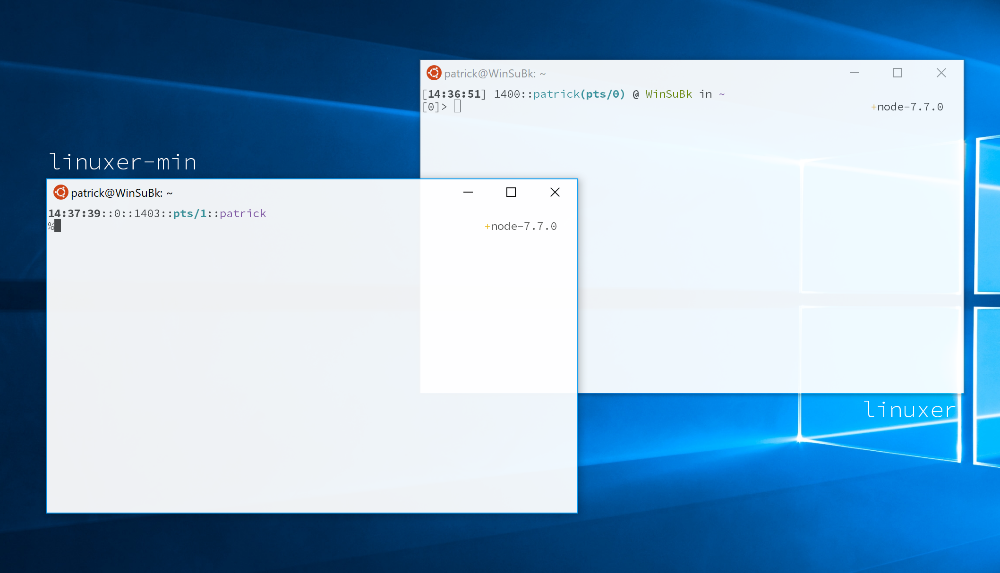

# linuxer series

**linuxer** is a powerful Oh-My-Zsh theme inspired by Yaris Alex Gutierrez's classyTouch, Yad Smood's ys, and Bureau theme. It features:

- Current Line of Command
- Current TTY Display
- Current Directory status
- Last Returned Error Code
- Mercurial and Git Status Support
- NVM and RVM Support

**linuxer-min** is a lightweight fork of Linuxer. which provide you most simple yet most productive environment.

**linuxer-fancy** is a fancy and beautiful theme based on agnoster keeping all the feature from the linuxer theme.

## Installation

**wget should be installed**

type the following in the terminal:

**for linuxer**

`wget -p https://raw.githubusercontent.com/patrick330602/linuxer/master/linuxer.zsh-theme -O ~/.oh-my-zsh/themes/linuxer.zsh-theme`

**for linuxer-min**

`wget -p https://raw.githubusercontent.com/patrick330602/linuxer/master/linuxer-min.zsh-theme -O ~/.oh-my-zsh/themes/linuxer-min.zsh-theme`

**for linuxer-fancy**

`wget -p https://raw.githubusercontent.com/patrick330602/linuxer/master/linuxer-fancy.zsh-theme -O ~/.oh-my-zsh/themes/linuxer-fancy.zsh-theme`

> If you want to use virtualenv, please insert `export VIRTUAL_ENV_DISABLE_PROMPT=1` into your shell configuration file

## License

The Project is under MIT.
